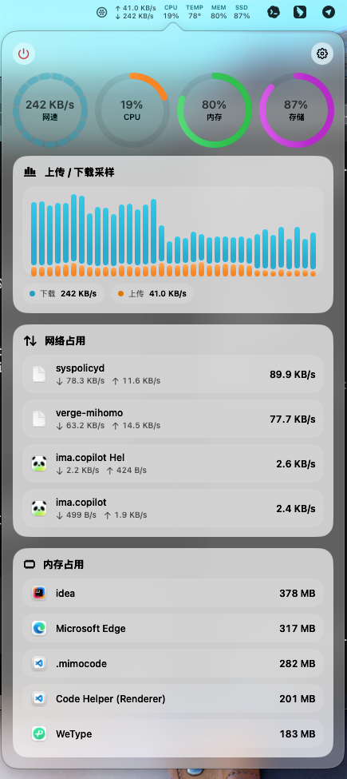

# SilBar

一款轻量级 macOS 菜单栏系统监控工具，实时显示系统状态信息。



## 功能特性

- **网速监控** - 实时显示上传/下载速度
- **CPU 监控** - CPU 占用率和温度
- **内存监控** - 内存使用百分比
- **存储监控** - 磁盘空间使用情况
- **网络图表** - 网络流量可视化
- **剪贴板历史** - 在状态栏快速访问并复制最近 20 条文本
- **进程列表** - 显示网络和内存占用最高的进程

## 系统要求

- macOS 26+
- Swift 6.2+

## 安装

### 从源码构建

```bash
git clone https://github.com/silfoxs/silbar.git
cd silbar
swift build -c release
```

构建产物位于 `.build/release/SilBar`

### 构建 App Bundle

```bash
./script/build_and_run.sh package
```

App 版本默认读取 `build.env`：

```env
APP_VERSION=0.2.0
APP_BUILD_NUMBER=1
```

如果不在 `build.env` 中指定 `APP_VERSION`，脚本会从最新的 `Silbar-v*` tag 推导版本，例如 `Silbar-v0.2.0` 会生成 app 版本 `0.2.0`。如果两者都未设置，构建将退出并提示错误。

也可以在构建时临时覆盖：

```bash
APP_VERSION=1.2.3 APP_BUILD_NUMBER=42 ./script/build_and_run.sh package
```

## 使用

运行 SilBar 后，它会出现在菜单栏中。点击图标即可查看系统状态面板。

### 状态栏显示项

可在设置中自定义显示：
- 网络上传下载量
- CPU 占用
- CPU 温度
- 内存占用
- 硬盘占用

## 项目结构

```
Sources/SilBar/
├── App/              # 应用入口
├── Models/           # 数据模型
├── Services/         # 系统数据采样服务
├── Stores/           # 状态管理
├── Support/          # 辅助工具类
└── Views/            # UI 视图
```

## 技术栈

- SwiftUI
- AppKit
- IOKit (CPU 温度读取)

## 许可证

MIT License
